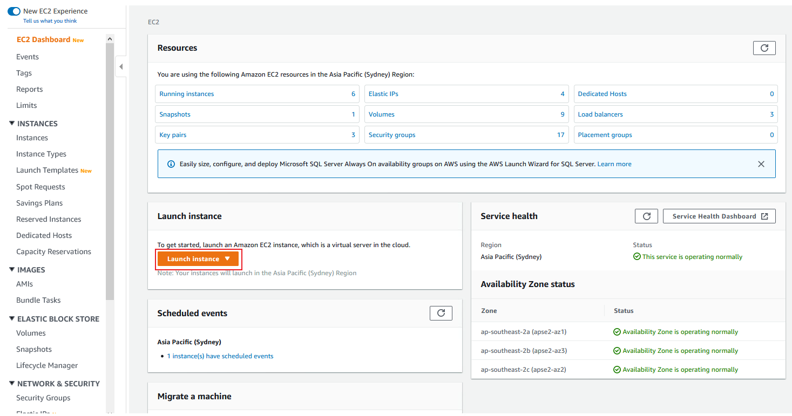
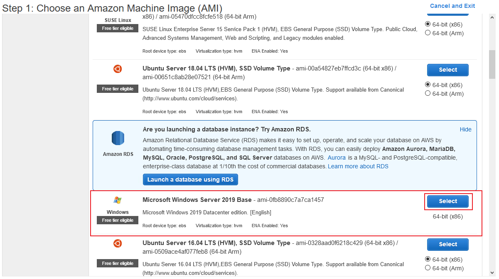
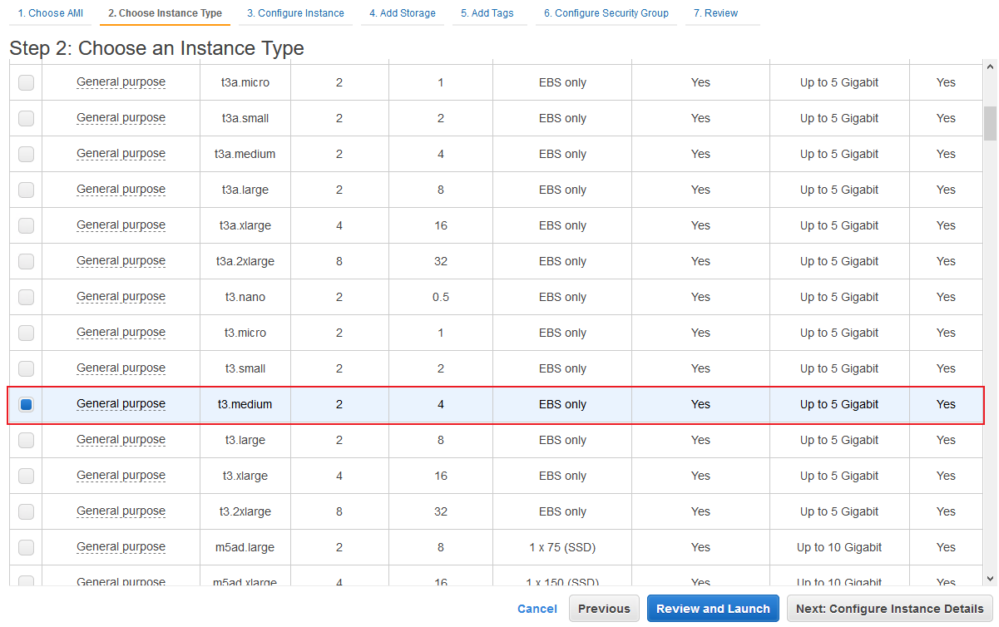
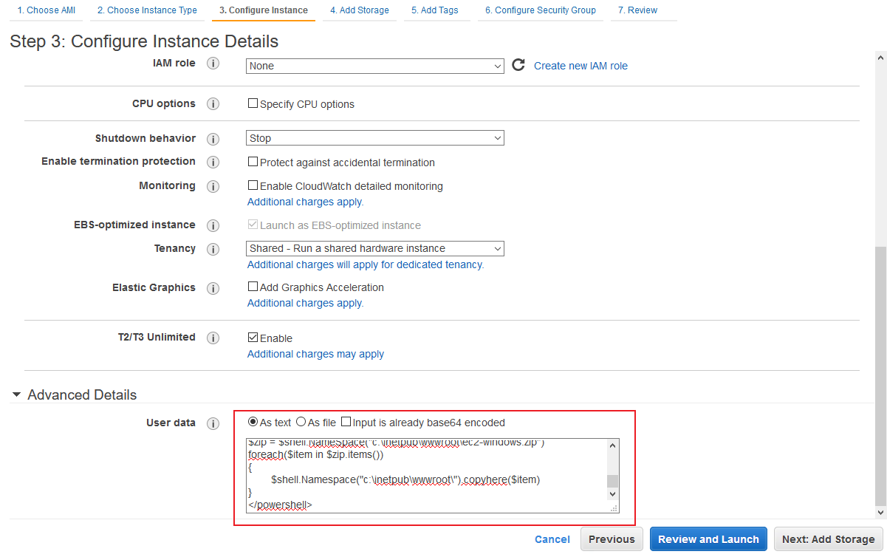

# **EC2 Hands On Lab**

Amazon Elastic Compute Cloud (Amazon EC2) is a web service that provides resizable compute capacity in the cloud. Amazon EC2’s simple web service interface allows you to obtain and configure capacity with minimal friction. Amazon EC2 reduces the time required to obtain and boot new server instances to minutes, allowing you to quickly scale capacity, both up and down, as your computing requirements change. Amazon EC2 changes the economics of computing by allowing you to pay only for capacity that you actually use.

This lab will walk you through launching, configuring, and customizing an EC2 web server (Windows and Linux) using the AWS Management Console

## **Getting Started with Windows Server on Amazon EC2**

### **Launch a Windows Web Server Instance**

In this example we will launch a Windows Server 2019 instance with the IIS web server installed upon boot.

1. Sign into the AWS Management Console and open the **Amazon EC2 console** https://console.aws.amazon.com/ec2.

2. Click on **Launch Instance**



3. Scroll down and click Select on the Windows Server 2019 Base AMI



4. In the **Choose Instance Type** tab, select the **t3.medium** instance size and click **Next: Configure Instance Details**



5. On the **Configure Instance Details** page, expand the **Advanced Details** section, copy/paste the script below into the User Data field (this PowerShell script will install/start IIS and deploy a simple web page) and click **Next: Add Storage**:

<Details>
<Summary>UserData Code</Summary>

```powershell
<powershell>
Import-Module ServerManager;
Install-WindowsFeature Web-Server -IncludeManagementTools -IncludeAllSubFeature
remove-item -recurse c:\inetpub\wwwroot\*
(New-Object System.Net.WebClient).DownloadFile("https://immersionday-labs.s3.amazonaws.com/ec2-windows.zip", "c:\inetpub\wwwroot\ec2-windows.zip")

$shell = new-object -com shell.application
$zip = $shell.NameSpace("c:\inetpub\wwwroot\ec2-windows.zip")
foreach($item in $zip.items())
{
	$shell.Namespace("c:\inetpub\wwwroot\").copyhere($item)
}
Start-Process "iisreset.exe" -NoNewWindow -Wait
</powershell>
```
</Details>
<br>



On the **Step 4: Add Storage** screen, **Click Next: Add Tags** to accept the default Storage Device Configuration and move to the Step 5: Add Tags screen.

Next, choose a “friendly name” for your instance. This name, more correctly known as a tag, will appear in the console once the instance launches. It makes it easy to keep track of running machines in a complex environment. Name yours according to this format: **_“[Your Name] Web Server”_**.

Then click Next: **Configure Security Group**.
