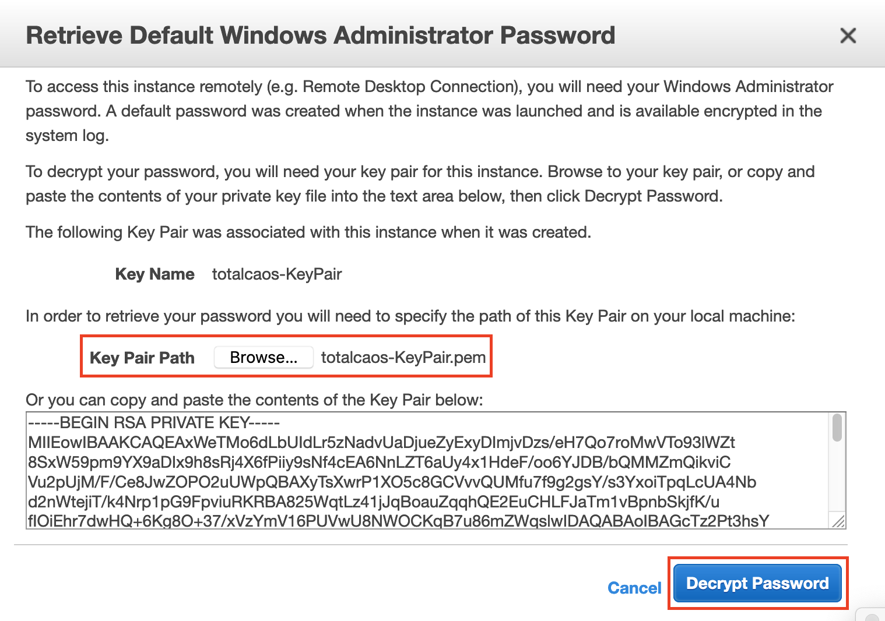
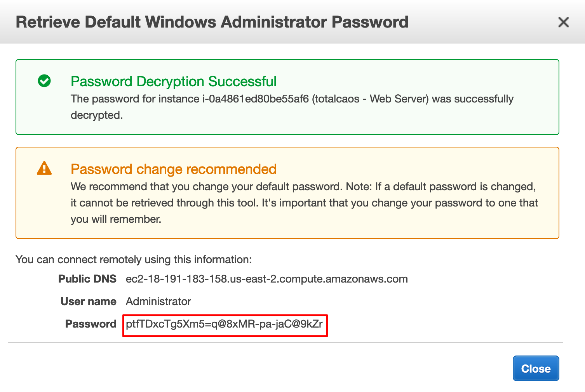
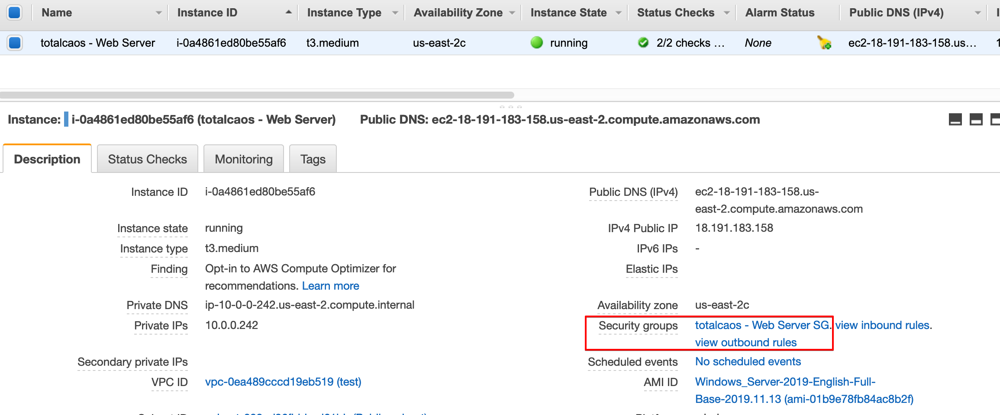
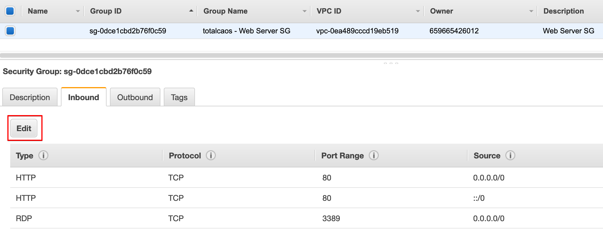

# **EC2 Hands On Lab (contd.)**
## **Remote access to your EC2 Instance**

To connect to the Windows desktop, we will use a RDP client.  If you’re using a Windows PC, use the bundled Remote Desktop application.  For Mac users, if you don’t have a RDP client already installed, **[download it from here](https://docs.microsoft.com/en-us/windows-server/remote/remote-desktop-services/clients/remote-desktop-clients)**

Retrieve the automatically generated, encrypted Windows password by right clicking your instance and selecting **Get Windows Password**


On the next screen, click the Choose File button and select the private key file that was automatically downloaded earlier when you launched the instance.  Then click **Decrypt Password** to obtain the Administrator password



The decrypted Administrator password should look something like this:



Note that since only you have the private key, it’s important to understand the automatically generated password can only be decrypted by you.  So it’s important to keep this key secure.  Generally, the automatically generated password is changed by the customer after first login. If the automatically generated password is not changed and the private key is lost, there’s no way to recover the password.

Start your RDP application and connect to the hostname of your instance.   The hostname can be found in a couple of different places.  For example, in the web console, you’ll see hostname listed as the **Public DNS** of the instance


In your RDP application, use **Administrator** as the username along with the decrypted password.  Once connected, you will have access to the Windows desktop.   At this point, feel free to explore Windows.  You should change the Administrator password to something friendlier or easy to remember (but still secure of course)

## **Connectivity to the Instance**

In this section, you will ping the EC2 instance that you just created and learn more about security groups along the way.

As the EC2 instance has a public IP address and it’s in the public subnet which has a route to an IGW, we should be able to ping the instance over the internet.


To ping the instance, you need to open your CLI. On Windows, open the **Command Prompt**. On Mac, open the **Terminal**. Type ping, then a space, then paste the Public IP from above and click **enter**.

If the instance is reachable, we expect to see lines appearing such as

```bash
64 bytes from 18.191.183.158: icmp_seq=0 ttl=238 time=169.294 ms
```
you will see request timeouts instead. You will see lines that say something similar to:

```bash
bash-3.2$ ping 18.191.183.158
PING 18.191.183.158 (18.191.183.158): 56 data bytes
Request timeout for icmp_seq 0
```

**_Why aren’t we able to reach this instance?_** 

You can confirm that the instance is in the public subnet and check the route table associated with that subnet to make sure there is a route to the IGW. 

Next, let’s check our virtual firewall configurations. As you remember, we left the NACL of the public subnet as is, which allows all traffic by default. So, let’s check the security group associated with this instance.

In the EC2 dashboard, go to the Instances section in the sidebar. Select the instance that you created and look at the Description tab. In the left column, click on the first Security groups link. It should be called something similar to **_“[Your Name] Web Server SG”_**



You are now in the **Security Groups** dashboard. Go to the **Inbound** tab. 

Remember when we were creating the EC2 instance we only specified ports 3389 and 80 opened when creating the Security Group.

Pings use ICMP, so we will need to change the security group rule to allow ICMP traffic.  Click on the **Edit** button.



Click on the **Add Rule** button, then add a rule to allow ICMP inbound from all IP addresses.  Click **Save** to save the rule.


_In this lab we are creating a Windows server that has ICMP access that is “open to the world” this is something that you wouldn’t normally do._

Since security groups are stateful, you don’t need to edit the outbound rules. The security group will allow the instance to respond to the ping since it saw the ping arrive at the instance. This change will also take effect immediately, so we can try to ping the instance again right away

Go back to your CLI and hit the up arrow and then enter to try and ping the instance again.

```bash
bash-3.2$ ping 18.191.183.158
PING 18.191.183.158 (18.191.183.158): 56 data bytes
64 bytes from 18.191.183.158: icmp_seq=0 ttl=86 time=301.609 ms
64 bytes from 18.191.183.158: icmp_seq=1 ttl=86 time=366.385 ms
64 bytes from 18.191.183.158: icmp_seq=2 ttl=86 time=966.490 ms
64 bytes from 18.191.183.158: icmp_seq=3 ttl=86 time=270.890 ms
64 bytes from 18.191.183.158: icmp_seq=4 ttl=86 time=278.862 ms
64 bytes from 18.191.183.158: icmp_seq=5 ttl=86 time=417.914 ms
64 bytes from 18.191.183.158: icmp_seq=6 ttl=86 time=268.993 ms
64 bytes from 18.191.183.158: icmp_seq=7 ttl=86 time=465.508 ms
^C
--- 18.191.183.158 ping statistics ---
8 packets transmitted, 8 packets received, 0.0% packet loss
round-trip min/avg/max/stddev = 268.993/417.081/966.490/218.663 ms
```

<Details>
<Summary><b>Optional - Test Access to Private Instance</b></Summary>
<br>
You can go through the same process in the last two sections in order to test access to a private EC2 instance. 

The only difference will be in the **Configure Instance Details** section, you will select the **Private subnet**. 

Remember that this is not best practice for public facing resources, but in this case the instance will not be reachable anyways because the private subnet does not have an IGW route. 

We just want a public IP to try to access, and for this, the automatically assigned public IP is sufficient. Additionally, you will want to open up your security group from the beginning. That way, this private instance will be the same in every way to the public instance you just created except that it does not have a route to an IGW and thus cannot be accessed publicly

</Details>
<br>

## **Additional EC2 Concepts**

Now that we have an understanding of connecting to and accessing our EC2 instances, lets look at some additional EC2 concepts in the **[next section](AdditionalConcepts.md)**.

<br>
<Details>
<Summary><b>Optional (Challenge) - Deploy an EC2 Instance Using CloudFormation</b></Summary>


</Details>