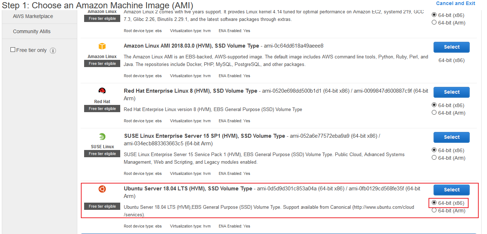
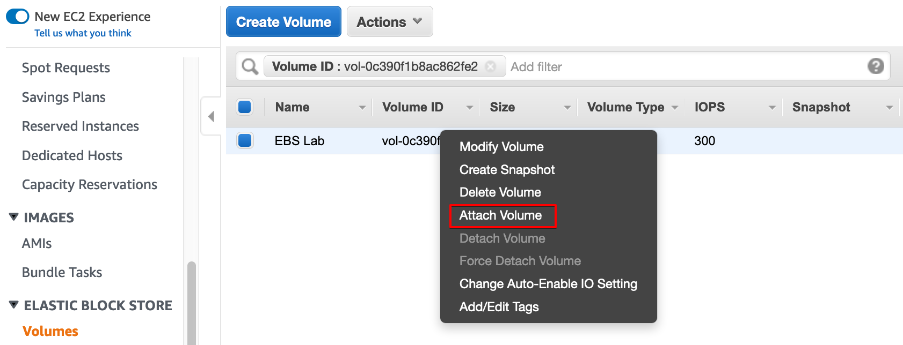
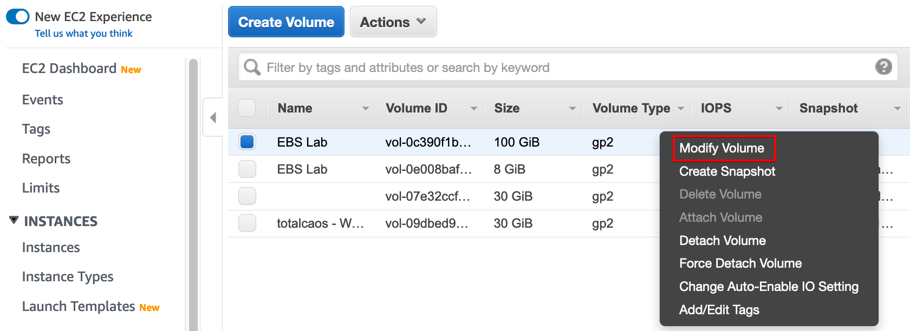
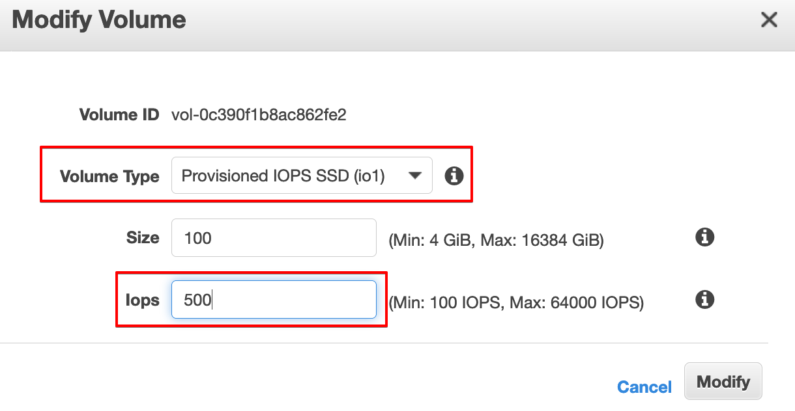

**[Labs Home](../README.md)**

# **Storage on AWS Hands on Labs**

In this lab, we will look at working with Elastic Block Store (EBS) Volumes and Object Stores (S3).

## **Working with Elastic Block Store (EBS) Volumes**

The purpose of this AWS Immersion Day hands-on lab is to familiarize you with the Amazon Elastic Block Store (EBS) service. EBS is a block storage service that enables you to create volumes, and attach / detach them to Elastic Compute Cloud (EC2) instances. You can create EBS volumes with different volume types, such as: Provisioned IOPS (io1), General Purpose Solid State (gp2), Throughput Optimized HDD (st1), or Cold HDD (sc1), depending on the performance characteristics of your application. Once an EBS volume has been created, you can switch between different volume types, using the ModifyVolume API. Keep in mind that EBS volume modifications are limited to once every six (6) hours.

During this lab, you'll create an EBS volume, attach it to an EC2 instance, format and mount the volume, generate some ongoing disk activity, and then modify the volume attributes to increase its performance.

### **Create and attach an EBS Volume**

The first thing you’ll do is create a new Elastic Block Store (EBS) volume. You’ll simply specify the initial size for the volume, and assign it the default General Purpose SSD volume type. Next, you’ll attach the new EBS volume to an EC2 instance.

Navigate to the **[AWS EC2 Console](https://ap-southeast-2.console.aws.amazon.com/ec2/home?region=ap-southeast-2)** and launch a **t3.small** Ubuntu EC2 instance in the previously created VPC's public subnet.  Ensure you enable SSH access (port 22) from the internet to this instance.



Note the **InstanceID** and **Availability Zone** of your EC2 instance; you'll need this in a moment.

Under the **Elastic Block Store** heading, click **Volumes**


Click on the **Create Volume** button


Create a new volume with the following parameters:
* **Volume Type:** General Purpose SSD (gp2)
* **Volume Size:** 100 GB
* **Availability Zone:** The availability zone in which your instance was launched


**Click the link** containing the new EBS VolumeId


Right-click the new volume and click **Attach Volume**



Search for your **InstanceID** and click the **Attach** button.  Note that the Device section is auto-populated.


At this point, your new EBS volume should be created and attached to your EC2 instance

### **Run a Disk-heavy Workload**

Now that you've created an EBS volume, and attached it to an EC2 instance, you'll generate some ongoing disk activity. In the steps below, you'll log into your EC2 instance, create a filesystem on the EBS volume, mount the volume, and then initiate some disk activity

Log into the EC2 instance via SSH.

Note: the following sections assumes a MacOS / Linux command-line.  If you are on a Windows Operating system, use Putty or any other SSH client.

```bash
ssh -i <location of private key> ubuntu@ec2-18-222-231-42.us-east-2.compute.amazonaws.com
```

Find the disk drive using the **lsblk** command

```bash
ubuntu@ip-10-0-0-155:~$ lsblk
NAME        MAJ:MIN RM  SIZE RO TYPE MOUNTPOINT
loop0         7:0    0   89M  1 loop /snap/core/7713
loop1         7:1    0   18M  1 loop /snap/amazon-ssm-agent/1480
nvme0n1     259:0    0    8G  0 disk
└─nvme0n1p1 259:1    0    8G  0 part /
nvme1n1     259:2    0  100G  0 disk
```

Create a filesystem on the disk using the **mkfs.ext4** command, using the device name from the previous step (in this case `nvme1n1`)

```bash
ubuntu@ip-10-0-0-155:~$ sudo mkfs.ext4 /dev/nvme1n1
mke2fs 1.44.1 (24-Mar-2018)
Creating filesystem with 26214400 4k blocks and 6553600 inodes
Filesystem UUID: 508f1c63-f170-459d-b9bc-e074c0529f8d
Superblock backups stored on blocks:
	32768, 98304, 163840, 229376, 294912, 819200, 884736, 1605632, 2654208,
	4096000, 7962624, 11239424, 20480000, 23887872

Allocating group tables: done
Writing inode tables: done
Creating journal (131072 blocks): done
Writing superblocks and filesystem accounting information: done
```

Mount the filesystem using the **mount** command

```bash
ubuntu@ip-10-0-0-155:~$ mkdir ~/ebstest; cd ~/ebstest; sudo mount /dev/nvme1n1 ~/ebstest
ubuntu@ip-10-0-0-155:~/ebstest$
```

Check if the file system is successfully mounted using the **df** command

```bash
ubuntu@ip-10-0-0-155:~/ebstest$ df -h
Filesystem      Size  Used Avail Use% Mounted on
udev            967M     0  967M   0% /dev
tmpfs           196M  736K  195M   1% /run
/dev/nvme0n1p1  7.7G  1.1G  6.7G  14% /
tmpfs           978M     0  978M   0% /dev/shm
tmpfs           5.0M     0  5.0M   0% /run/lock
tmpfs           978M     0  978M   0% /sys/fs/cgroup
/dev/loop0       90M   90M     0 100% /snap/core/7713
/dev/loop1       18M   18M     0 100% /snap/amazon-ssm-agent/1480
tmpfs           196M     0  196M   0% /run/user/1000
/dev/nvme1n1     98G   61M   93G   1% /home/ubuntu/ebstest
```

The line `/dev/nvme1n1     98G   61M   93G   1% /home/ubuntu/ebstest` shows that the new EBS volume has been successfully mounted.

Run this Bash command to generate disk activity

```bash
while [ true ]; do uuid=$(uuidgen); echo $uuid | sudo tee $uuid.json > /dev/null; done;
```

The Bash script will write some random JSON files to disk drive. Let the previous Bash command run while you move onto the next step

### **Modify EBS Volume Attributes**

While the Bash script is still running on your EC2 instance, generating new data, you'll modify the attributes of the Elastic Block Store (EBS) volume, to scale it up to a different volume type and increase its IOPS.

Navigate back to the EBS Volumes section of the [AWS Console](https://us-east-2.console.aws.amazon.com/ec2/home?region=us-east-2#Volumes)

Right-click your 100 GB volume and click **Modify Volume**



For Volume Type, choose **Provisioned IOPS SSD (IO1)**, and specify **500 Iops**.



Click the **Modify** button, then **Yes** to confirm

Your volume will take some time to change its attributes to the newly specified volume type and IOPS performance level. Notice that the disk activity on your Linux EC2 instance continues to run while the EBS volume is being modified.

Note the changed volume type:


## **Clean up**

After completing this lab, make sure you clean up any resources that you created during execution of the lab steps.
1.	Detach the EBS volume from the EC2 instance
2.	Delete the EBS volume


After completing this lab, you should be familiar with the essentials of the Amazon Elastic Block Store (EBS) service. You’ve learned how to create a new EBS volume and attach it to an EC2 instance. Next, you logged into your EC2 instance and partitioned and mounted the disk, and generated some mock disk activity. Finally, you used the AWS Management Console to reconfigure the EBS volume’s attributes to change the volume type and increase its performance.

Let's move on to the **[next module](s3lab.md)** to look at Object Storage, i.e. S3

<Details>
<Summary><b><u>Challenge task:</u> Use a cloud formation template to complete this lab</b></summary>

Re-use or modify the cloud formation template you created during the **[EC2 Hands on Labs](../ec2lab/AdditionalConcepts.md)** to launch an **Amazon linux EC2 instance** to complete this lab. Use the code snippet below to automatically configure the file system in the CloudFormation template.

```yaml
AWSTemplateFormatVersion: 2010-09-09
Resources:
  Ec2Instance:
    ...
    ...
    Metadata:
      AWS::CloudFormation::Init:
        config:
          commands:
            1_pvcreate:
              command: pvcreate /dev/xvdf
            2_vgcreate:
              command: vgcreate vg0 /dev/xvdf
            3_lvcreate:
              command: lvcreate -l 100%FREE -n myapp vg0
            4_mkfs:
              command: mkfs.ext4 /dev/vg0/myapp
            5_mkdir:
              command: mkdir /var/myapp
            6_fstab:
              command: echo "/dev/mapper/vg0-myapp /var/myapp ext4 defaults 0 2" >> /etc/fstab
            7_mount:
              command: mount -a
    Properties:
      ...
      ...
      UserData:
        'Fn::Base64':
          !Sub |
           #!/usr/bin/env bash
         set -o errexit
         yum -y update aws-cfn-bootstrap
         /opt/aws/bin/cfn-init -v --stack ${AWS::StackName} --resource EC2Instance --region ${AWS::Region}
         /opt/aws/bin/cfn-signal --exit-code $? --stack ${AWS::StackName} --resource EC2Instance --region ${AWS::Region}
      ...
      ...
Outputs:
  InstanceId:
    Description: InstanceID of the new EC2 Instance.
    Value: !Ref 'Ec2Instance'
  InstanceIpAddress:
    Description: Public IP Address of the EC2 Instance.
    Value: !Ref 'EIpAddress'

```

</Details>

<br>

**[Labs Home](../README.md)**
